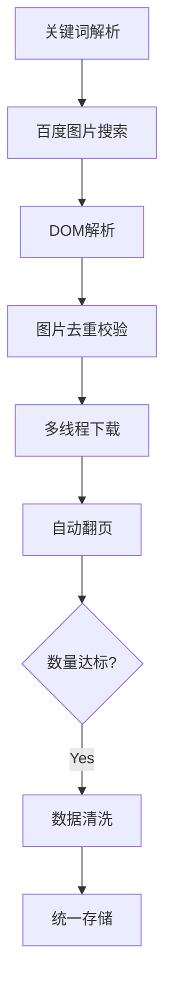
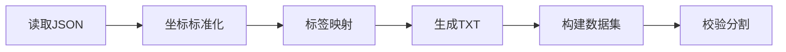

# 🐗 图片爬取与标注工具

本工具提供一站式图片爬取和自动化标注解决方案，支持从百度图片批量下载指定内容并生成YOLO格式训练数据。

---

## 🛠️ 核心功能

### 📥 智能图片抓取
- 多关键词并行爬取
- 自动翻页与去重机制
- 自适应图片质量过滤
- 多线程加速下载

### 📂 文件管理系统
- 二级目录结构（原始分类/清洗后数据）
- 自动文件名冲突处理
- EXIF信息校验

### 🤖 自动化标注
- JSON→YOLO格式自动转换
- 坐标标准化处理
- 多标签索引映射
- 自动生成训练集清单

---

## 🚀 快速入门

### 1️⃣ 环境配置
```bash
# 安装依赖
pip install -r requirements.txt
```

### 2️⃣ 配置文件说明
```python
# config.py

# 并发控制
MAX_THREADS = None  # None为无限制

# 目标采集量（实际可能上浮5%）
TARGET_QUANTITY = 2000

# 采集配置组（支持多分类）
words = [
        {
            'word': 'blue',
            'key': ['车牌', '蓝色车牌']
        },
		{
            'word': 'green',
            'key': ['新能源', '绿牌']
        }
    ]

# 最终输出目录
file_name = 'licence_plate'

# YOLO标签映射表
keyword = ['green', 'blue']
```

### 3️⃣ 运行指令
```bash
python main.py

请选择模式：
1) 爬虫模式 - 启动图片采集
2) 标注模式 - 生成训练数据
```

---

## 📌 使用规范

### 标注文件要求
1. JSON与图片**严格同名**
2. 仅识别矩形标注（shape_type=rectangle）
3. 有效标注必须包含完整坐标信息
4. 标签名称需在CLASS_MAP中定义

**示例标注文件：**
```json
{
  "shapes": [
    {
      "label": "licence_plate",
      "points": [[323,351], [602,687]],
      "shape_type": "rectangle"
    }
  ],
  "imagePath": "001.jpg",
  "imageHeight": 1080,
  "imageWidth": 1920
}
```

### 目录结构
```
img/          # 原始分类数据
│   └── blue/          
│       ├── 001.jpg
│       └── 001.json
licence_plate/           # 最终数据集
│   ├── images/        # 全部图片
│   └── labels/        # YOLO标签
```

---

## ⚠️ 注意事项

1. **网络协议**
   - 禁止商业用途和批量转售数据
   - 遵守百度Robots.txt规定

2. **数据安全**
   - 定期备份img目录
   - 建议使用虚拟环境运行
   - 敏感数据需加密存储

---

## ⚖️ 免责声明

本工具仅限用于：
✅ 学术研究  
✅ 技术验证  
✅ 个人学习  

严禁用于：
❌ 商业数据采集  
❌ 隐私信息收集  
❌ 网络攻击前置  

使用者应自行承担：
- 违反服务条款导致的账号封禁
- 数据版权纠纷
- 网络请求过量造成的法律风险

**继续使用即表示您已阅读并同意本声明**

---

## 🔄 工作流程

### 爬虫模式


### 标注模式

